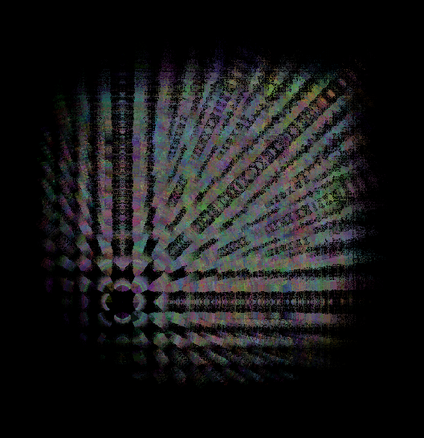

# chinoxel

TODOs:

- [x] General framework (grid/render/compare with views/optimize)
- [ ] Handle camera extrinsics
- [ ] Manual backward pass implementation (store gradients)
- [ ] Add some unit tests
- [ ] Handle spherical harmonics in the nodes
- [x] Interpolate node contributions
- [x] Color buffers
- [ ] General speedup
- [x] Propagate rays over depth

  

